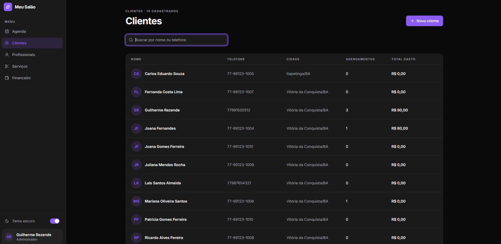
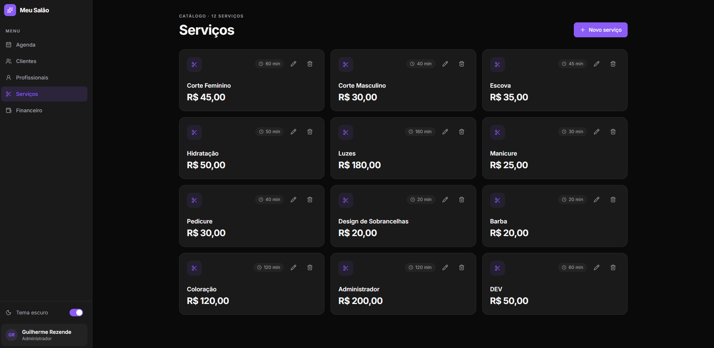

# Salão Beleza

Sistema de salão de beleza com frontend em React/Vite e API REST em Node.js/Express, usando MongoDB.

## Telas

| Clientes | Serviços |
| --- | --- |
|  |  |

| Agenda | Criar agendamento |
| --- | --- |
|  |  |

## Pré-requisitos

- Node.js 22 ou superior e npm.
- Uma instância MongoDB acessível pela API (por exemplo, MongoDB Atlas).
- Docker Desktop com Docker Compose, caso queira executar a API em container.

## Executar backend pela IDE

1. Abra a pasta raiz do projeto na IDE (por exemplo, VS Code).
2. Use o arquivo `.env` fornecido na raiz do projeto; não é necessário configurá-lo manualmente.
3. No terminal integrado, instale as dependências do backend:

   ```bash
   npm ci
   ```

4. Inicie a API em modo de desenvolvimento:

   ```bash
   npm run dev
   ```

Para executar sem reinicialização automática, use `npm start`. A API fica disponível em `http://localhost:8000`. Mantenha este terminal aberto enquanto usar o frontend e encerre com `Ctrl+C`.

## Executar backend com Docker Compose

Com o Docker Desktop aberto e o `.env` fornecido na raiz do projeto, execute a partir da raiz:

```bash
docker compose up --build
```

O Compose constrói e inicia a API na porta `8000`. Para iniciar em segundo plano, acrescente `-d`:

```bash
docker compose up --build -d
```

Para acompanhar os logs:

```bash
docker compose logs -f app
```

Para parar e remover o container:

```bash
docker compose down
```

O serviço Docker usa o modo de desenvolvimento e observa alterações nos arquivos do backend.

## Executar frontend pela IDE

Abra um segundo terminal integrado na raiz do projeto e entre na pasta do frontend:

```bash
cd frontend
npm ci
npm run dev
```

O Vite disponibiliza o frontend em `http://localhost:5173`. Mantenha os terminais do frontend e do backend em execução ao mesmo tempo. O frontend chama a API em `http://localhost:8000`, então inicie o backend primeiro.

Opcionalmente, crie `frontend/.env` copiando `frontend/.env.example` e ajuste `VITE_NOME_SALAO` para personalizar o nome exibido. A variável `VITE_API_URL` também está no exemplo, mas ainda não é utilizada pelo código: a URL da API está fixa no frontend em `http://localhost:8000`.

Para gerar a versão de produção do frontend:

```bash
cd frontend
npm run build
```

Os arquivos gerados ficam em `frontend/dist/`.

## Rotas da API

A URL base local é `http://localhost:8000`. As rotas disponíveis são:

- `/servico`
- `/cliente`
- `/profissional`
- `/fila-espera`
- `/agendamento`
- `/pagamento`

Consulte `collection/Collection-CRUD-Salao-Beleza.json` para exemplos de requisições `GET`, `POST`, `PATCH` e `DELETE`.